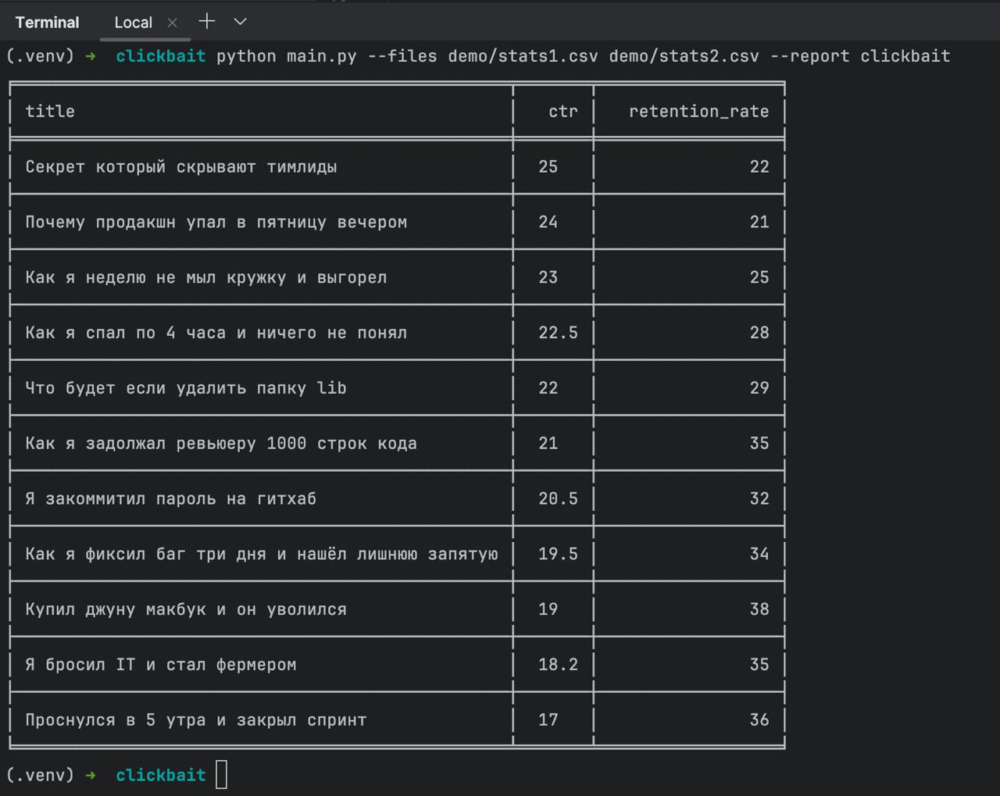

# clickbait-cli

CLI-приложение для анализа метрик YouTube-видео из CSV-файлов и создания отчетов.

## Установка

```bash
pip install -r requirements.txt
```

## Использование

```bash
python main.py --files stats1.csv stats2.csv --report clickbait
```

### Формат CSV-файлов

CSV-файлы должны содержать следующие колонки:

```
title,ctr,retention_rate,views,likes,avg_watch_time
```

### Отчеты

- **clickbait** — видео с `ctr > 15` и `retention_rate < 40`, отсортированные по убыванию значения CTR. Колонки в отчете: `title`, `ctr`, `retention_rate`.

### Добавление нового типа отчета

1. Отнаследовать новый класс от `AbstractReport` в папке `reports/`.
2. Зарегистрировать его в `reports/__init__.py` вызовом `registry.register(YourReport())`.
3. Можно использовать его вызовом `--report <name>`, не нужно ничего менять в `main.py`.

### Демонстрация запуска



Также приложил [отчет](demo/coverage.md) по тестовому покрытию (правда не прикрутил игнорирование отдельных директорий и файлов для расчета)
